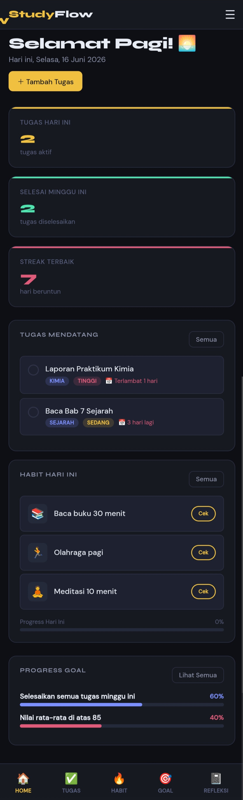
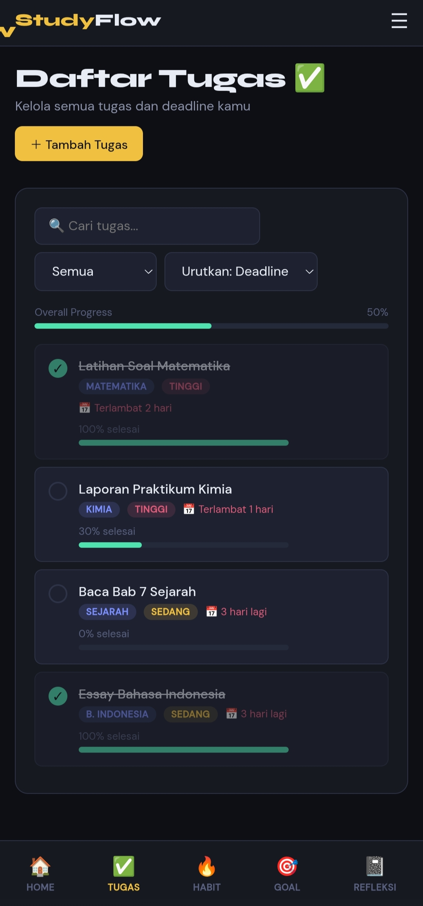
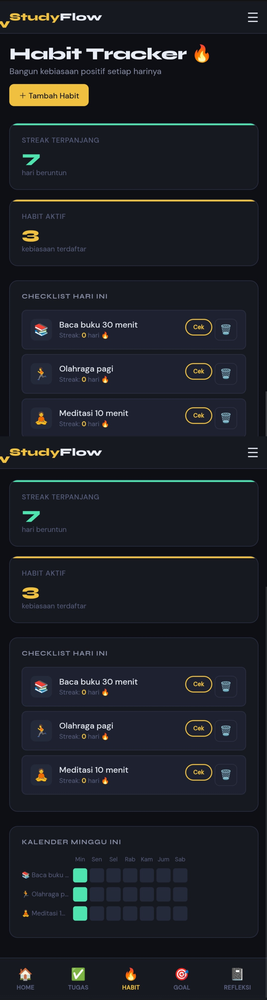
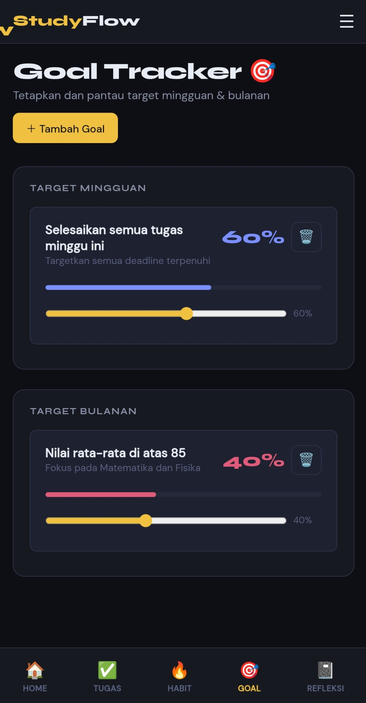
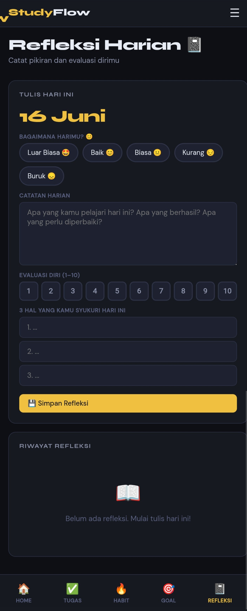

# StudyFlow
StudyFlow is a student productivity web application designed to help users manage tasks, build habits, track goals, and write daily reflections in one place.

Features:
1.Task Management
  - Create, edit, delete, and complete tasks
  - Set priorities and deadlines
  - Track task progress

 2.Habit Tracker
  - Daily habit tracking
  - Streak calculation
  - Weekly activity overview

 3.Goal Tracker
  - Weekly goals
  - Monthly goals
  - Progress monitoring
  
 4.Daily Reflection
  - Mood tracking
  - Self-evaluation
  - Gratitude journal

Technology:
- HTML
- CSS
- JavaScript
- LocalStorage

Current Status:

StudyFlow is currently in active development.

Version: v1.0

Roadmap:

- [ ] Responsive UI improvements
- [ ] Progressive Web App (PWA)
- [ ] Data export and backup
- [ ] Statistics and analytics
- [ ] Cloud synchronization
- [ ] Mobile app version

## Screenshots

Dashboard:

Tasks:

Habit Tracker:

Goal Tracker:

Reflections:

## Live Demo
https://biaghy.github.io/StudyFlow/

Author:

Developed by Biaghy.
